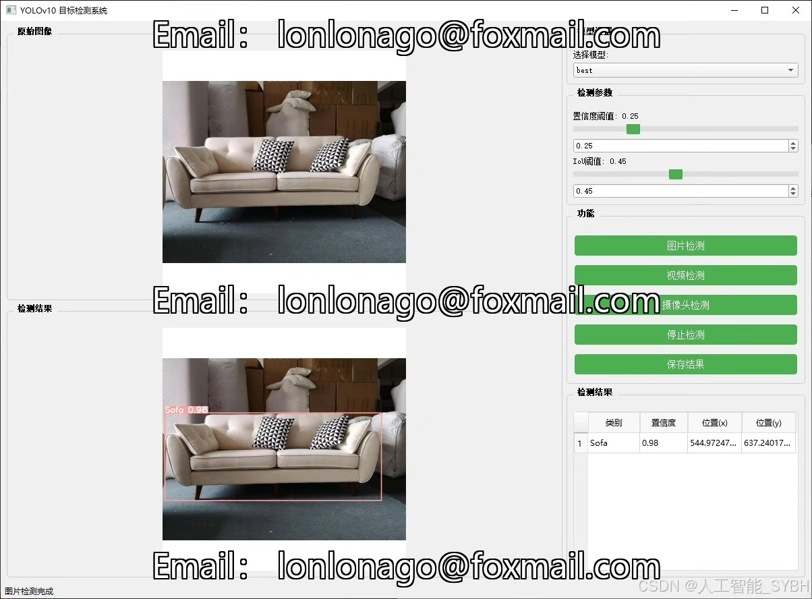
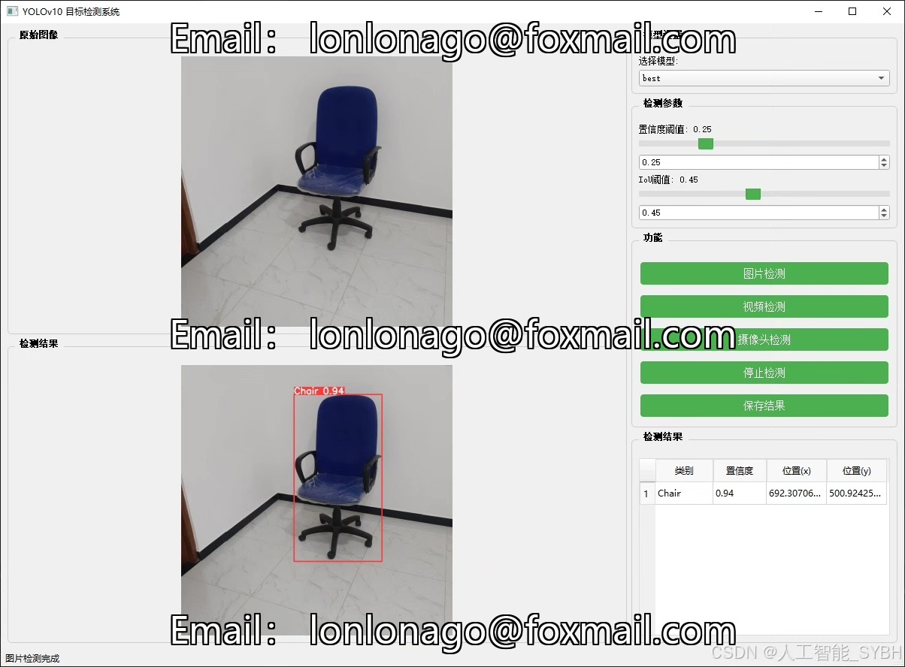
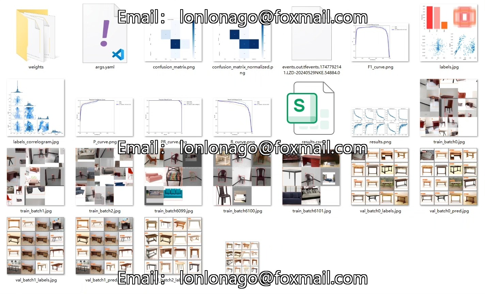
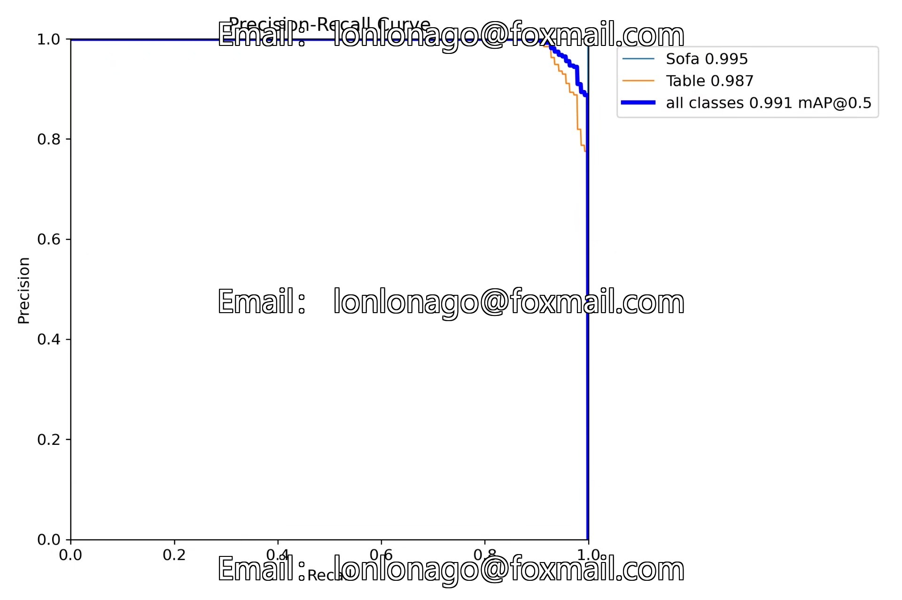
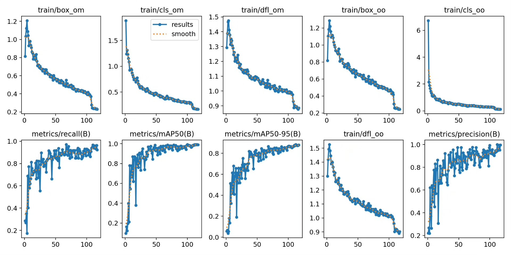
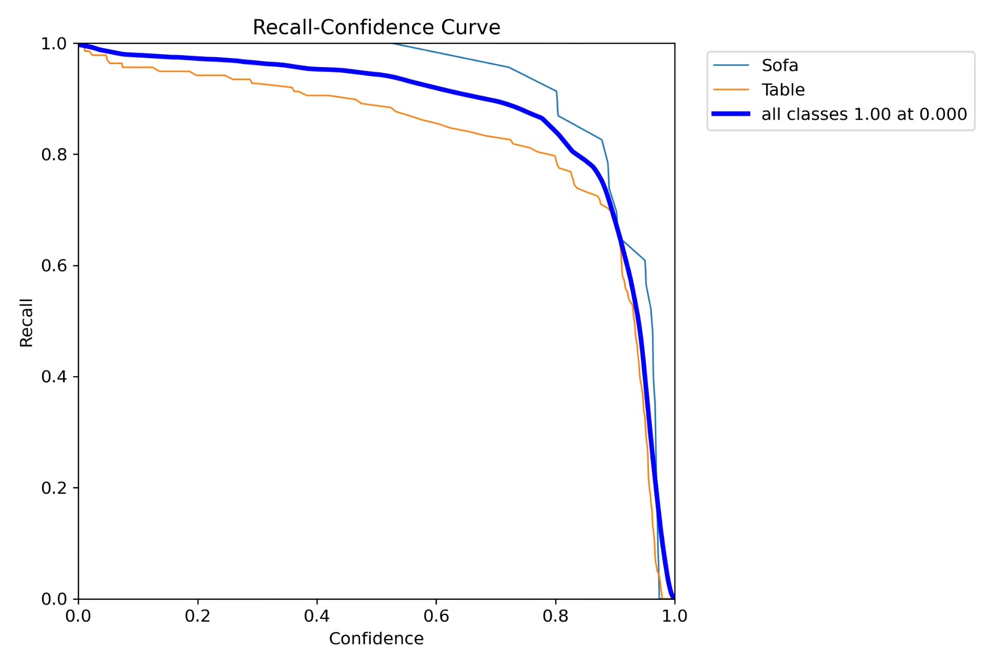
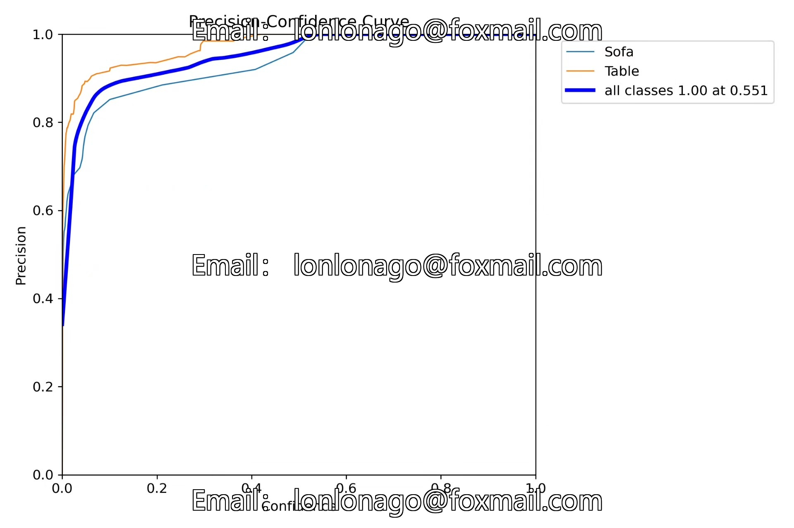
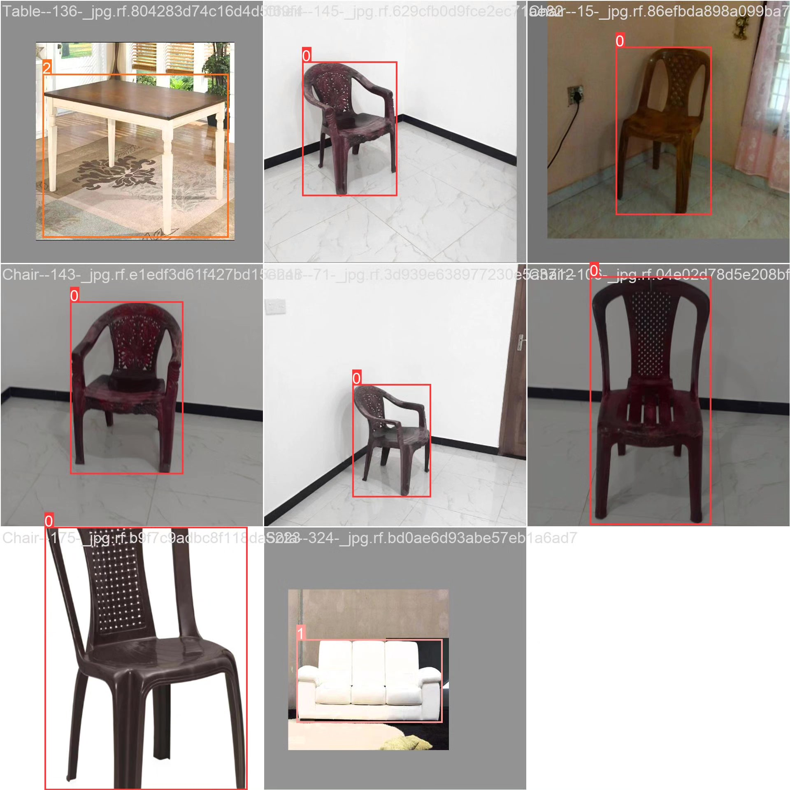

# Based on deep learning YOLOv10 for furniture recognition detection system (YOLOv10)

## Body

This project has developed a smart visual system specifically for furniture recognition based on the YOLOv10 object detection algorithm. It can accurately recognize and locate three common types of furniture: chairs (Chair), sofas (Sofa), and tables (Table). The system uses a self-built dataset containing 689 images for training and evaluation. By optimizing the network structure and training strategies, this system achieves high detection accuracy while maintaining real-time detection speed. It can be applied in various fields such as smart home, indoor navigation, and furniture e-commerce. The project not only validates the effectiveness of the YOLOv10 algorithm on a small-scale specialized dataset but also provides a scalable technical framework for the field of furniture recognition.

The company's products have obtained the official commercial license certification from YOLO.

We provide after-sales service.

After payment, we will provide WeChat ID to answer questions anytime.

Environment configuration: We will provide an instruction tutorial for environment configuration, and WeChat will provide answers.

Remote installation service: If you need remote configuration, an additional fee of 69 is required, with all fees refunded if the configuration fails (only refund installation fees for old computers).

Retraining dataset: After setting up the environment, you can train on your own computer. If you need us to retrain, just pay 69 plus computing power fees (2.5 yuan/hour).

Full after-sales service

## Images

## Payment

Here is a pay link on Stripe ( https://buy.stripe.com/3cs8yP7sY87d0vu9AB ). Please contact me lonlonago@foxmail.com after funding $89, and I will send you a complete data files , thank you!

